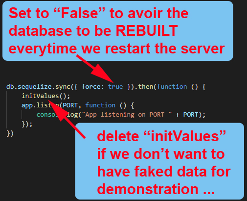

# Employees Organizer - ReactJS
# (This is rather a React-Redux Architecture. Will Use ReactJS after finishing the React-Redux ...)

---
# BUILDING: EMPTY FOR NOW ...

---

## Aim
Building a project based on an EER (Enhanced Entity-Relationship).

## Enhanced Entity-Relationship

## Miracle ;-)

If we choose to use the database with pre-filled data, we could see MIRACLES: some people get hired BEFORE their birth ;-) (we could fix it easily, but it isn't the goal which is manipulating data with tables in a database ...)

## Configuration (VERY IMPORTANT)

At the project's root folder, we have a file name "**server.js**", by the end, we have:

It's very important to fallowing the instruction, otherwise, you could have very disapported surprise ...

---------------

## Author
* Dinh HUYNH - All Rights Reserved!
* dinh.hu19@yahoo.com