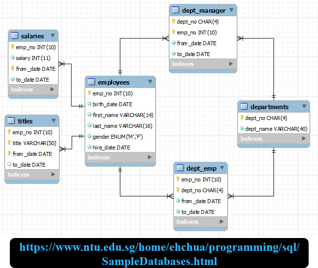

# Employees Organizer - ReactJS

# BUILDING: Backend: Done! Need 2 Add frontend ...

---

## Aim
Building a project based on an EER (Enhanced Entity-Relationship). The goal is to learn to build project base on someone's idea, which is much more difficult than with ours.

> This project is one of about 30-35 others building by mixing:
>   * Front-End: **jQuery**, **ReactJS**, **React-Redux**, **Angular** (2-5), **Ionic3**, **View.js**
>   * Back-End: 5 APIs (2 with **MongoDB** and 3 with **SQL**)
> 
> These are **3-tier Architecture** projects. Everything is started (almost) from scratch (the diagrams for the databases come from the Internet - with link to to source on each picture - with errors which were fixed)
>
> The **Front-End** are NOT the most beautiful because not much work on it. The goal is to use very different technologies on very different purposes.

## Enhanced Entity-Relationship

## Configuration (VERY IMPORTANT)

At the project's root folder, we have a file name "**server.js**", by the end, we have:

It's very important to follow the instruction, otherwise, you could have very disappointed surprises ...

---------------

## Author
* Dinh HUYNH - All Rights Reserved!
* dinh.hu19@yahoo.com